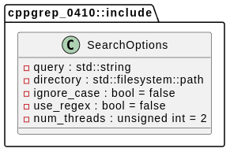

 
    std::string query;                    // Search term or regular expression
    std::filesystem::path directory;      // Directory path for search
    bool ignore_case = false;             // Whether to ignore case
    bool use_regex = false;               // Whether to use regular expressions
    unsigned int num_threads = 2;         // Number of worker threads
