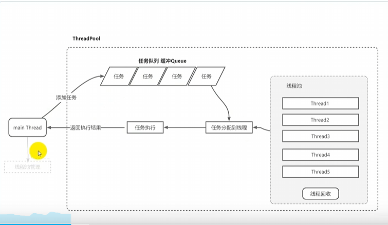

Here is the complete English translation of your requirements and design:

---

**Problem Objective:**
1. Identify overlapping regions among multiple polygons. If the overlapping region exceeds 50% of a polygon’s area, that polygon will not be included in the output.

**Business Logic:**

**Class Point**
- Private members:
  - `double x_;` // x coordinate
  - `double y_;` // y coordinate

**Class Polygon**
- Private members:
  - `vector<Point> points_;` // Stores the vertices of the polygon
  - `double area_;` // Stores the area of the polygon to avoid multiple calculations
  - `double max_ratio_;` // The maximum ratio of the intersection area with other polygons to its own area

- Member functions:
  1. **Check if a point is inside a polygon (Ray casting method)**
      - `bool point_inside_polygon(const Point& point);`
  2. **Determine if two polygons overlap (Edge intersection method)**
      - `bool polygon_overlap(const Polygon& other);`
  3. **Calculate the area of the polygon (Shoelace formula), only calculate once and store in a variable**
      - `double get_area();`
  4. **Compute the overlapping region of two intersecting polygons, generate a new polygon for the overlap, and update the value of max_ratio_**
      - `void polygon_clip(const Polygon& other);`

**Class PolygonFilter**
- Private members:
  - `vector<Polygon> polygons_;` // Stores all polygons to be filtered

- Member functions:
  1. **Read Polygon data from a JSON file to generate the polygon collection**
      - `void read_json();`
  2. **Loop through all polygons in the collection, calculate the overlap ratio between every pair, and update each polygon’s max_ratio_**
      - `void loop_filter();`
  3. **Traverse the collection and output polygons with max_ratio_ less than 0.5 to output.json**
      - `void output_result();`

---

**Thread Pool Logic:**
1. Create a thread pool. Since this is a compute-intensive task, the calculation of overlapping regions between two polygons can be packaged as tasks and executed asynchronously.
2. Algorithm complexity is N*N*10*5, where each polygon has about 10 vertices and each calculation involves 5 edges.
3. Compare execution time under single-threaded and multi-threaded conditions:

| Number of Polygons | Single-threaded | Multi-threaded |
|--------------------|-----------------|---------------|
| 100                | 24 ms           | 13 ms         |
| 1000               | 1758 ms         | 348 ms        |
| 10000              | 156498 ms       | 21729 ms      |

4. The number of threads equals the number of CPU cores.

---

**Parallel Computation with Thread Pool**
1. Types of thread pools: Fixed-size thread pool; Scalable thread pool (can dynamically add or remove threads for small tasks after reaching a fixed number).
2. Task queue: Each task handles the intersection between the current polygon (by index) and all subsequent polygons.

---

**Thread Pool Class**

---

**Thread Pool:**
1. Manager thread
2. Worker threads
3. Thread pool
4. Task queue
5. Thread safety:
    - Synchronization: Mutex, atomic variables
    - Thread communication: Condition variables

---

**Thread Pool Class**
- Members:
  1. Manager thread: Adjusts and controls the number of worker threads
  2. Worker threads:
      - Fetch tasks from the task queue for processing
      - If the task queue is empty, worker threads are blocked by a condition variable
      - Thread synchronization
      - Number of active tasks
      - Number of idle tasks
      - Max thread count
      - Min thread count
  3. Task queue:
      - Mutex
      - Condition variable
  4. Thread pool switch:
      - Boolean variable

---

**Asynchronous Thread Pool Class:**
- Members:
  - `thread* m_manager;`
  - `Map<>`
  - `vector<thread> m_workers;`
  - `atomic<int> m_minThread;`
  - `atomic<int> m_maxThread;`
  - `atomic<int> m_currentThread;`
  - `atomic<int> m_idleThread;`
  - `atomic<bool> m_isClosed;`
  - `queue<function<void()>> m_tasks;`
  - `mutex m_mutex;`
  - `condition_variable m_cv;` // Blocks consumer threads, no limit on task queue size

- Methods:
  - `ThreadPool()` // Constructor
  - `addTask()` // Producer process
  - `worker()` // Consumer process

---